# Dog App

## Overview

Dog App provides a fun way to track daily steps paired with an intrinsic motivation model (walking your dog)

### Problem

Why is your app needed? Background information around any pain points or other reasons.

### User Profile

Who will use your app? How will they use it? Any special considerations that your app must take into account.

### Features

- As a user, I want to have a virtual dog I can bring as a walking companion
- As a user, I want to be able to log my walks
- As a user, I want to be able to see my past walk data in the form of graphs
- As a user, I want to be able to record my data (walks) without an account
- As a user, I want to be able to create an account to backup my data
- As a user, I want to be able to access the site as an mobile app (a mobile view)
- As a user, I want to be able to use the site as a new-tab extension (a desktop view)
- As a user, in the desktop view, I want to be able to see a short summary of my daily progress

## Implementation

### Tech Stack

- React
- MySQL
- Express
- Client libraries
    - react
    - react-router-dom
    - react-select (or a similar library for dropdowns)
    - axios
    - sass
- Server libraries
    - express
    - cors
    - mysql2
        - I want to write SQL queries directly reather than use a query builder or ORM, but I have found it hard to solve the issue of migrations.
    - bcrypt for password hashing

### APIs

- The multiavatar API will be used to generate user avatars off their username

### Sitemap

- Home page - displays a dog sitting up
- Walking page
    - Record-a-walk form
- User statistics page
- User settings page
- Login page
- Register page

### Mockups

#### Home Page
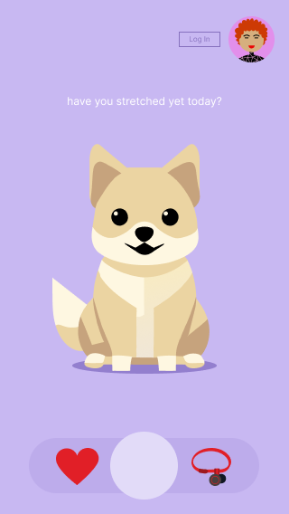
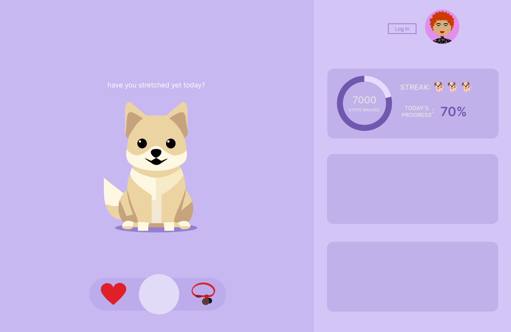

#### Walking Page
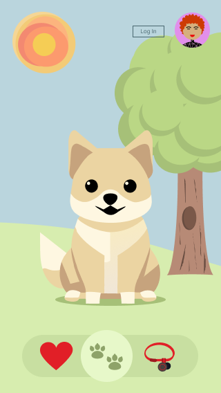
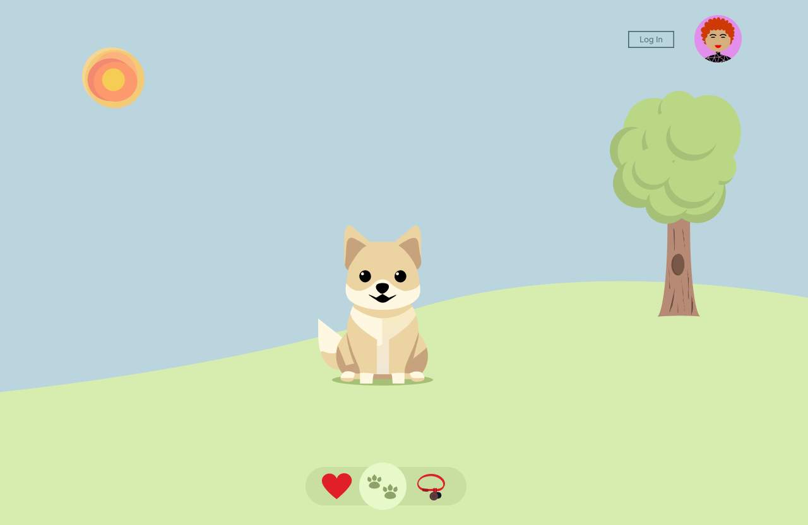

#### Record-a-Walk Form
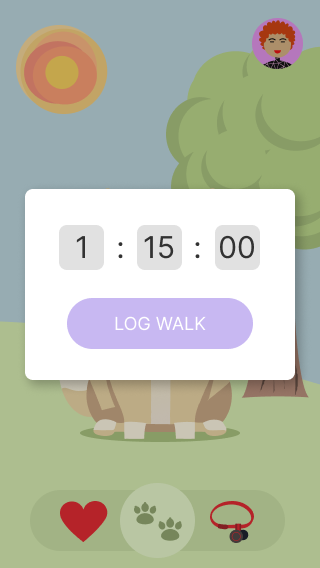
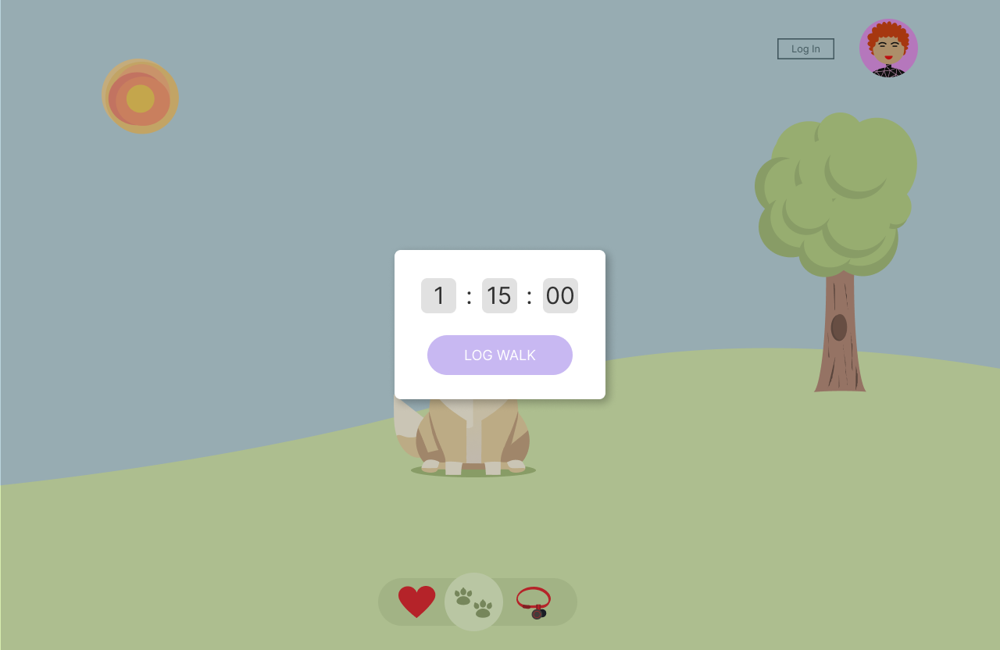

#### User Statistics Page
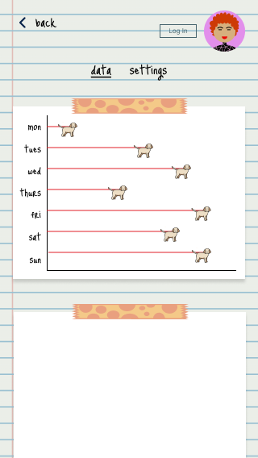
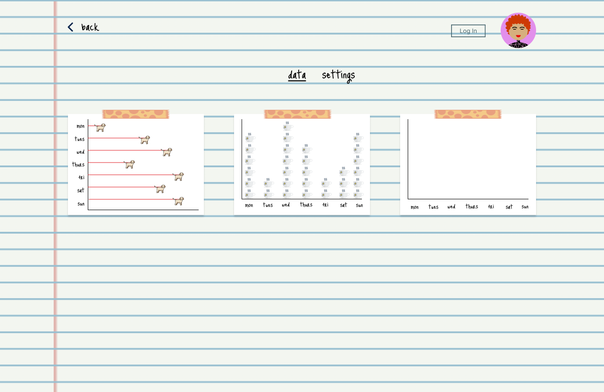

#### Login Page
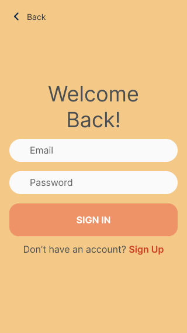
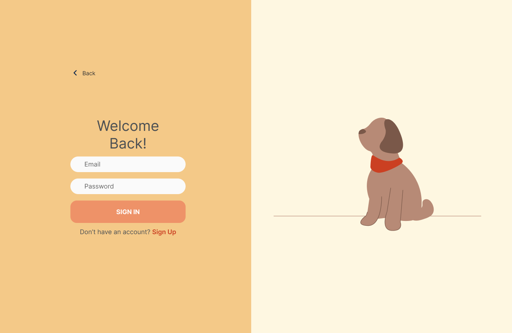

#### Register Page
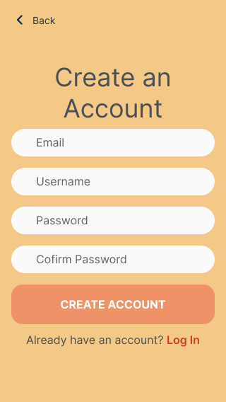
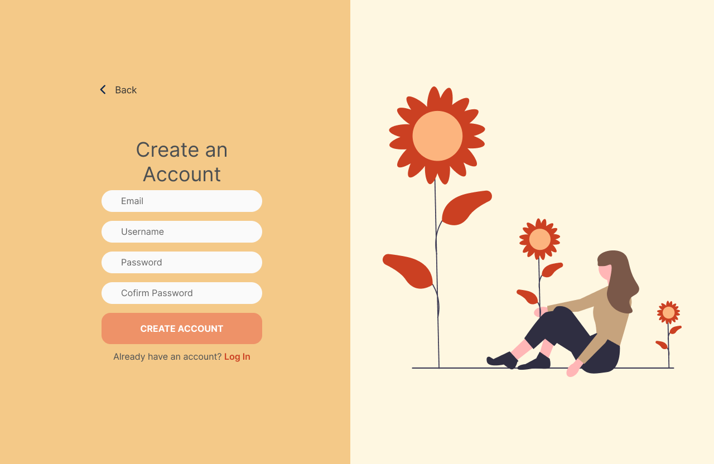

### Data

- This app intends to mimic the experience of using a mobile app. This means: before login, a user's walk data will be saved locally (in localStorage).
    - Only a week's worth of data will be saved at any time to alleviate space usage
    - If a user decides to create an account, any data stored locally will be transferred to the database

#### Local Storage Structure

```
"stepsWalked": [
    {
        "minsWalked": 2,
        "steps": 120,
        "timestamp": 1705259672162
    }
]
```

```
"preferences": {
    "avatar": 'https://api.multiavatar.com/maria.svg',
    "tooltips": true
}
```


#### Database Structure
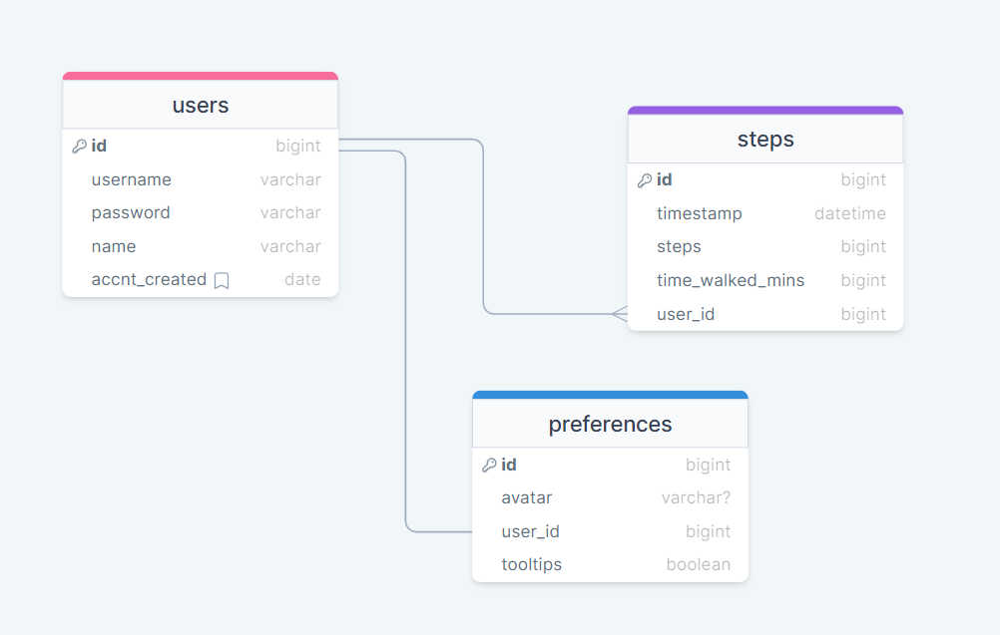

### Endpoints

**GET /steps/:userId**

- Get steps the user has walked in the last number of days.

Parameters: 
- userId: the id of the user to get data from (this may be fully replaced by the JWT token?)
- token: user's JWT token

Queries:
- days (optional): the number of days to get data for, defaults to 7

Response:
```
[
    {
        "logged_date": "15/1/2024",
        "total_steps": "360"
    },
    ...
]
```

**POST /steps**

- Record a 'walk'

Parameters:
- token: JWT of the user

Body of request: 
```
{
    "steps": 320,
    "minsWalked": 2,
    "userId": 1
}
```
Note: userId may be fully replaced by JWT?

Response:
```
{
    "steps_id": 10,
    "entry_logged": 2024-01-15 01:22:37,
    "steps": 320,
    "mins_walked": 2,
    "user_id": 1
}
```

**POST /user/register**
- Create a new user

Body:
```
{
    "username": example,
    "email": exampe@example.com,
    "password": example123
}
```

Response:
```
{
    "token": "seyJhbGciOiJIUzI1NiIsInR5cCI6IkpXVCJ9.eyJzdWIiOiIxMjM0NTY3ODkwIiwibmFtZSI6I..."
}
```

**POST /users/login**

- Login user

Body:
```
{
    "email": exampe@example.com,
    "password": example123
}
```

Response:
```
{
    "token": "seyJhbGciOiJIUzI1NiIsInR5cCI6IkpXVCJ9.eyJzdWIiOiIxMjM0NTY3ODkwIiwibmFtZSI6I..."
}
```

### Auth

- Authentiaction will be done using JWT
    - Added after core features have first been implemented
    - Store JWT in localStorage, remove when a user logs out
    - Add states for logged in that will change where the user's data gets sent to and whether 'Log In' prompts are shown

## Roadmap

Scope your project as a sprint. Break down the tasks that will need to be completed and map out timeframes for implementation. Think about what you can reasonably complete before the due date. The more detail you provide, the easier it will be to build.

**These steps have already been done:**

- Create client structure and boilerplates

- Create server structure and boilerplates

- Create home page

- Create 'walking' page

- Feature: Form to record walk 
    - Implement form
    - Create functionality to save steps to local storage
    - Create POST /steps/:userid

- Feature: Show graph of user's walk data
    - Create user data page
    - Make graph
    - Create functionality to get steps from local storage
    - Create GET /steps/:userid

- Feature: Create account
    - Create register page and form
    - Create POST /user

- Feature: Login
    - Implement login page and form

**These steps need to be done:**

- Create migrations

- Create seeds with sample walking data

- Feature: walking companion (animations)
    - Animate sitting dog
    - Create and animate walking dog

- Feature: Desktop view
    - Create home page for desktop view
        - Create side panel
    - Create walk form desktop view
    - Create walk page desktop view
    - Create user data page desktop view
    - Create login page desktop view
    - Create register page desktop view

- Feature: Create account
    - Implement functionality to move local data to database

- Feature: Login
    - Create POST /users/login

- Feature: Implement JWT tokens
    - Server: Update expected requests / responses on protected endpoints
    - Client: Store JWT in local storage, include JWT on axios calls

## Nice-to-haves

Your project will be marked based on what you committed to in the above document. Under nice-to-haves, you can list any additional features you may complete if you have extra time, or after finishing.

- Add friends too compare dog walks
- Implement mobile part of the project as a react native app
- Use the expo-sensors library to automatically detect steps
- Make web app into a chrome extension
- Add water-intake-tracking functionality
- Add sleep-tracking functionality (allowing user to record sleeping time)
- Add food tracking functionality (record a 'snacks' - however, there are no plans for calorie or nutrition tracking functionality)
- Give the walking-page different backgrounds that change per season
- Allow user to customize their virtual pet
    - Change to other animals or dog breeds
    - Dress up pet
- Allow user to randomly generate an avatar fo themselves if they don't like their own
- Change home-page dog to react to how the user has been taking care of themselves (ie. looks sad if the user hasn't walked in some time, etc.)
- 