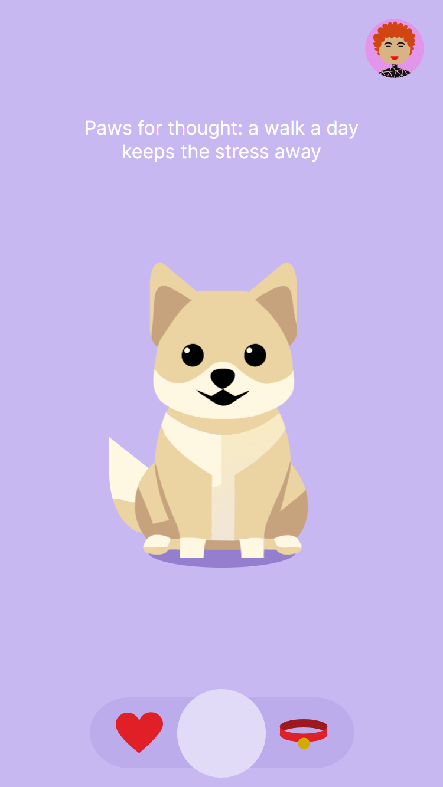
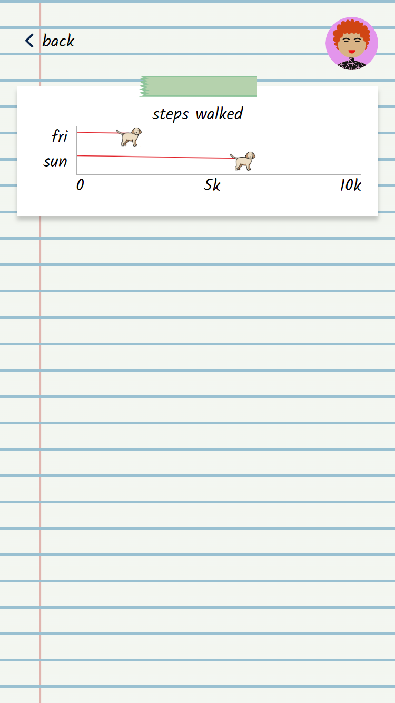
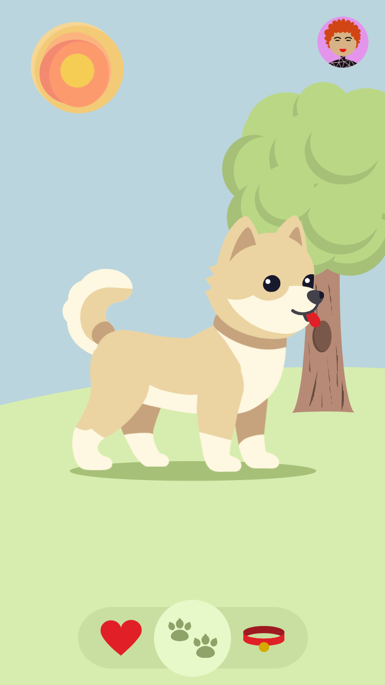
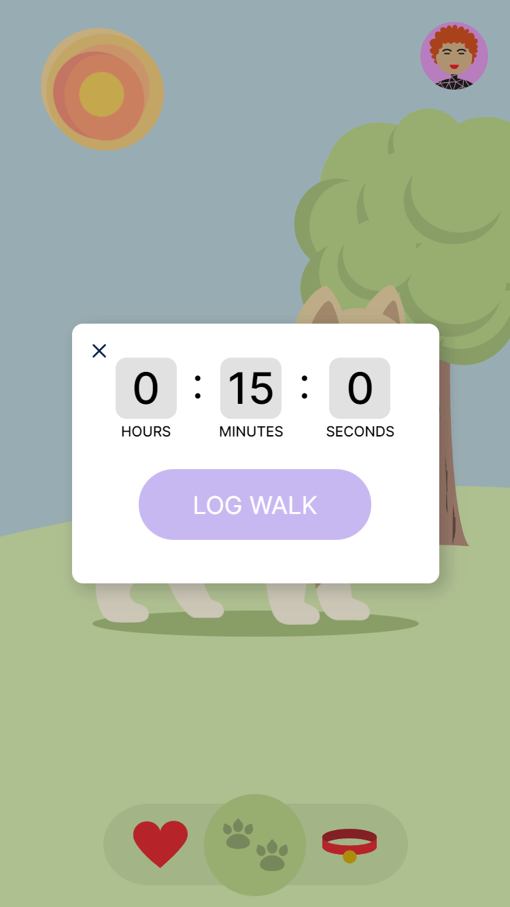
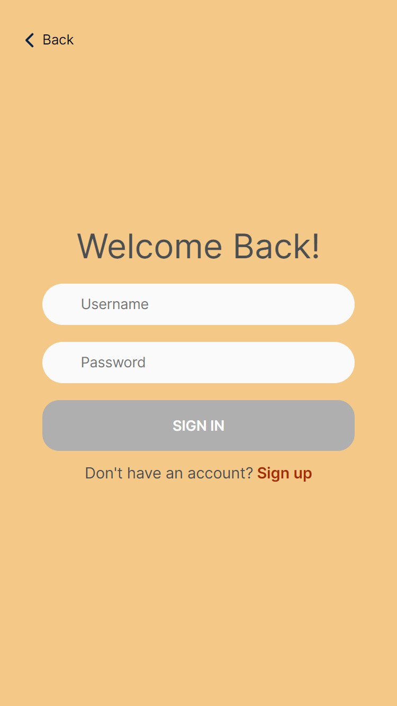
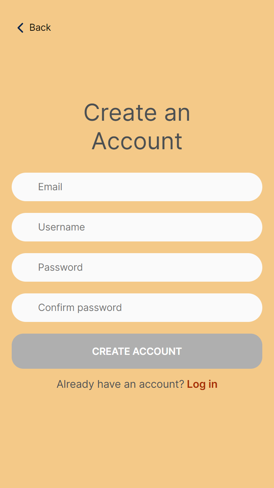

# Dog App

## Overview

Dog app lets you track your steps and visualize your walk history. But, it's not like your average pedometer app: dog app gives you a virtual companion to take on walks with you, helping you build healthier habits by reminding you to take care of your new found friend.

## Tech Stack

### Front End

The front-end of this app is made using React. All chartacter animations are written from scratch in Sass. The react-select and NextUI libraries were used to make dropdowns and tooltips.

### Back End

The back-end is written in Express with a MySQL database. Queries were written in SQL without the use of any ORMs or query builders. The db-migrate library was used to write migrations.

### Deployment

The deployment process has not been completed yet. The app will be deployed using Nginx on an AWS EC2 instance running RedHat Enterprise Linux. 

## Instalation Instructions

### Prereqs

- Node.js
- A running installation of MySQL

### Steps

1. Clone the git repository
2. Create a mysql database for the project
```
$ mysql -u root -p
mysql> CREATE DATABASE dog_app;
```

#### For the server

1.  Go into the server folder
``` 
cd server
```

2. Create a `.env` file based on `example.env` and fill out the variable values:
```
PORT = <server's port>
CORS_ORIGIN = <client's domain>

DB_HOST = <database domain>
DB_PORT = <database port>
DB_USER = <database username>
DB_PASS = <database password>
DB_NAME = <database name>
NODE_ENV = dev

SECRET_KEY = <a string to be used by jwt>
SALT_ROUNDS = <a number to be used by bcrypt>
```

3. Install server dependencies
```
npm install
```

4. Run migrations and seeding
```
$ npm run migrate:up
$ npm run seed
```

5. Start the server

#### For the client

1. Go into the client folder
```
cd client
```

2. Create a `.env` file based on `example.env` and fill out the variable values:
```
REACT_APP_API_URL = <domain of backend>
```

3. Install dependencies
```
npm install
```

4. Run client
```
npm start
```

The app will be running on http://localhost:3000/. Feel free to use the app without an account, make your own account, or use the test user `testUser/test123`.

## Gallery
 

 

 

## Future Work

This is an ever-updating project, the following are my next goals

- Deploy App

- Create user preferences/settings page
    - Change avatar
    - Disable tooltips
    - Change username / email / password
    - Delete account

- Add water-intake tracking functionality
    - Water tracking page and dog
    - Water intake form
    - Water intake graph

- Add sleep tracking functionality
    - sleep tracking page and dog
    - sleep intake form
    - sleep intake graph

- Add ability to set goals (ie. 15,000 steps in a day)
    - Goal input in settings
    - Show progress against goals in graphs and home side panel

- Allow user to customize virtual pet
    - Add accessories
    - Change pet to other animals or dog breeds
    - Show different backgrounds during different times of the year

- Make virtual pet react to how user's behavior
    - Pet looks sad if user hasn't walked in a while, etc.

- Create a React Native version of this app
    - Use device's pedometer functionality to track steps

- Create 'dog park' for user interaction
    - Allow users to make friends and compare daily walks